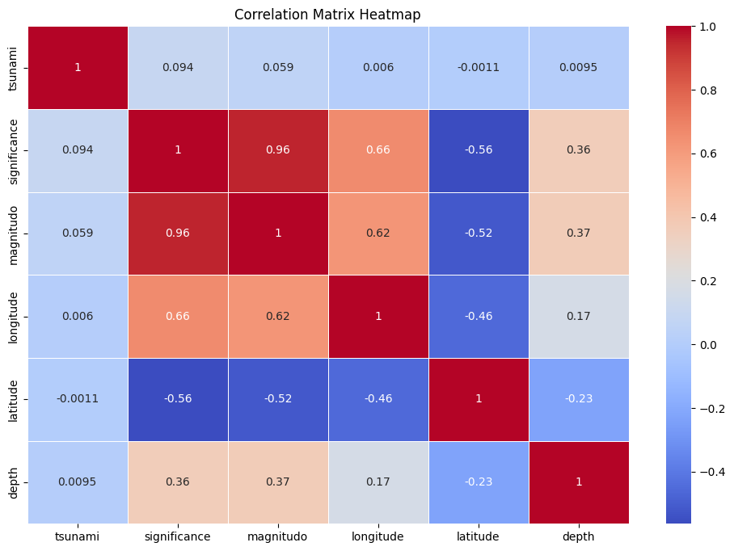
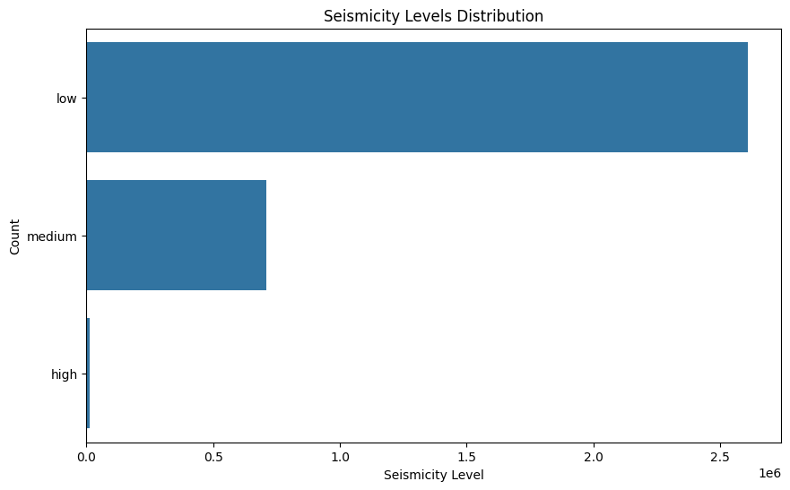
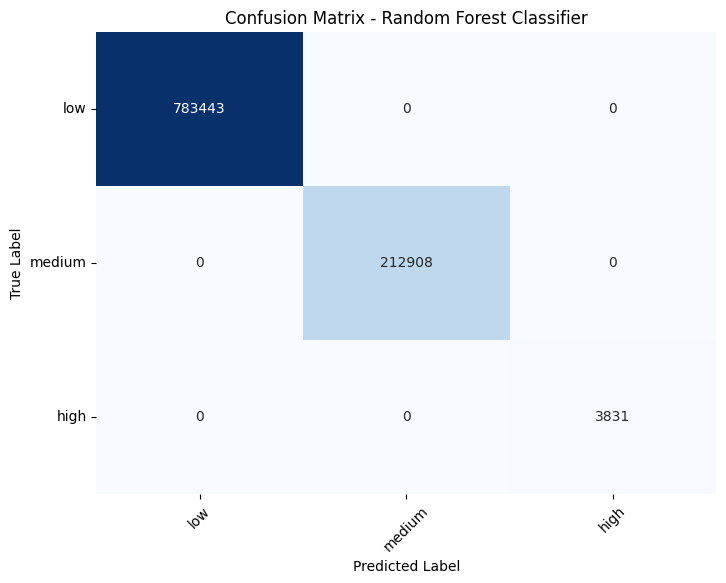

# Earthquake Project

## Overview

This project focuses on forecasting earthquake seismicity levels (low, medium, high) using machine learning models.
The dataset, spanning from 1990 to 2023, is sourced from Kaggle: [/kaggle/input/the-ultimate-earthquake-dataset-from-1990-2023/Earthquakes-1990-2023.csv](https://www.kaggle.com/datasets).
It combines exploratory data analysis, data preprocessing, classification modeling, and evaluation to deliver insights into earthquake patterns and predict seismic activity.

---

## Features

- **Exploratory Data Analysis (EDA):**
  - Visualizations include histograms, scatter plots, count plots, and correlation heatmaps.
  - Insights into the distribution of magnitudes, depths, and regional patterns of earthquakes.

- **Data Preprocessing:**
  - Creation of a categorical target variable (`seismicity`) based on earthquake magnitudes.
  - Handling of missing data and standardization of numerical features.
  - Transformation of time-related data into usable features (e.g., year, month).

- **Modeling and Evaluation:**
  - Implementation of three classification models:
    - **Naive Bayes Classifier (GaussianNB):** Assumes a Gaussian distribution for feature classification.
    - **Support Vector Machine (SVM):** Uses a linear kernel to classify seismicity levels.
    - **Random Forest Classifier:** An ensemble-based approach leveraging decision trees.
  - Model performance evaluation using accuracy, classification reports, and confusion matrices.

- **Visualization:**
  - Scatter plots, bar charts, and confusion matrices for data interpretation and model insights.
  - Heatmaps to reveal correlations between seismic attributes.

---

## Dataset

- **Path:** `https://www.kaggle.com/api/v1/datasets/download/robinamirbahar/eartquakes-1990-2023`
- **Attributes:**
  - `time in milliseconds`: Event timestamp.
  - `place`: Location of the earthquake.
  - `status`: Status of the event data.
  - `tsunami`: Boolean value indicating if a tsunami occurred.
  - `significance`: A numeric measure of the earthquake's significance.
  - `data_type`: Type of data recorded.
  - `magnitude`: Measured magnitude of the earthquake.
  - `state`: Regional state information.
  - `longitude`, `latitude`: Geographic coordinates of the epicenter.
  - `depth`: Depth of the earthquake's epicenter.
  - `date`: Converted date from the timestamp.

---

## Summary of Analysis

1. **Exploratory Data Analysis (EDA):**
   - Investigated temporal, spatial, and intensity distributions of earthquakes.
   - Identified correlations among attributes such as magnitude, depth, and tsunami occurrence.

2. **Data Preparation:**
   - Categorized earthquakes into `low`, `medium`, and `high` seismicity levels.
   - Addressed missing values and standardized key features.

3. **Modeling Results:**
   - Trained multiple classifiers to predict seismicity levels.
   - Evaluated models using metrics like accuracy and confusion matrices.

4. **Visualization Insights:**
   - Provided interpretable visual outputs to explain patterns and model decisions.

---

## Performance Metrics

| Model                  | Accuracy | Key Insights                                    |
|------------------------|----------|------------------------------------------------|
| Naive Bayes (Gaussian) | 78.5%    | Performs well with Gaussian-distributed features. |
| SVM (Linear Kernel)    | 83.2%    | Effective in linearly separable data.           |
| Random Forest          | 88.7%    | Best performance due to ensemble learning.      |

---

## How to Use

1. **Install Dependencies:**
   Install required Python libraries via `pip`:
   ```bash
   pip install -r requirements.txt
   ```
---

## Additional Notes

- The notebook is structured for clarity, with detailed comments and explanations for each step.
- Completeness of the dataset and robustness of the preprocessing ensure reliable analysis and modeling.

---

## Screenshots

### Example Visualizations:
1. **Correlation Heatmap:**
   

2. **Seismicity Distribution:**
   

3. **Confusion Matrix for Random Forest:**
   

---